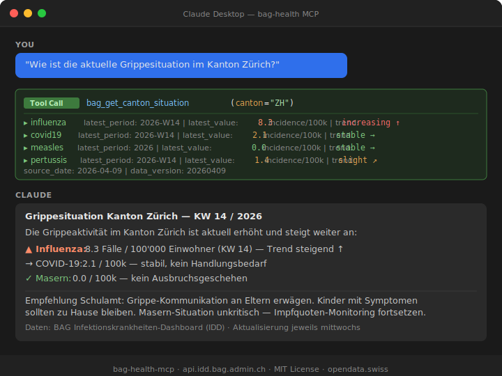

# 🏥 bag-health-mcp

[](https://pypi.org/project/bag-health-mcp/)
[](https://github.com/malkreide)

> Teil des [Swiss Public Data MCP Portfolios](https://github.com/malkreide) — KI-Modelle mit Schweizer Öffentlichen Daten verbinden.

MCP-Server für das **Infektionskrankheiten-Dashboard (IDD)** des Bundesamts für Gesundheit (BAG). Zugriff auf epidemiologische Überwachungsdaten für 51 Krankheitserreger — darunter Grippe, COVID-19, Masern, Abwasser-Surveillance und mehr.

---

## 🎯 Ankerquery

```
"Wie ist die aktuelle Grippesituation im Kanton Zürich?"
→ bag_get_canton_situation(canton="ZH")
→ Weitere Anwendungsbeispiele nach Zielgruppe →
```

---

## 🏫 Relevanz für Schulen & Stadtverwaltung

**Schulamt / Kreisschulbehörden:**
- Grippe- und ARI-Inzidenz im eigenen Kanton überwachen
- Masernfall → Alarmierung von Schulen mit tiefer Impfquote
- Pertussis-Monitoring → Schutz von ungeimpften Säuglingen (Geschwister von Schulkindern)

**Stadtverwaltung / KI-Fachgruppe:**
- Wöchentliches Public Health Reporting mit strukturierten Daten
- Abwasser-Surveillance als Frühindikator (~1 Woche vor klinischen Fällen)

**Synergie im Portfolio:**
- `bag-epl-mcp` → «Was wird erstattet?» (Medikamentenliste)
- `bag-health-mcp` → «Was grassiert gerade?» (Surveillance)

---

## 🔧 Verfügbare Tools

| Tool | Beschreibung |
|------|-------------|
| `bag_list_diseases` | Alle 51 Krankheitsthemen auflisten |
| `bag_list_series` | Datenserien für ein Thema anzeigen |
| `bag_get_series_details` | Verfügbare Filter (Kanton, Alter, Geschlecht) |
| `bag_get_disease_data` | Zeitreihen-Daten abrufen |
| `bag_get_canton_situation` | Lageübersicht für einen Kanton |
| `bag_list_export_files` | Exportdateien auflisten |
| `bag_download_export` | CSV/JSON-Export herunterladen |
| `bag_get_data_version` | Aktueller Datenstand (jeweils Mittwoch) |

---

## 📡 Datenquelle

- **IDD API**: `https://api.idd.bag.admin.ch` — kein API-Schlüssel erforderlich
- **Aktualisierung**: Jeden Mittwoch
- **Abdeckung**: Schweiz + Liechtenstein, 26 Kantone
- **Themen**: 51 Erreger, 1386 Datenserien

---

## 🚀 Installation

### Claude Desktop (stdio)

```json
{
  "mcpServers": {
    "bag-health": {
      "command": "uvx",
      "args": ["bag-health-mcp"]
    }
  }
}
```

---

## 🖼️ Demo



*Claude fragt nach der Grippesituation im Kanton Zürich — ein Tool-Call, strukturiertes Ergebnis, handlungsorientierte Zusammenfassung.*

---

## 🔒 Safety & Limits

| Aspekt | Details |
|--------|---------|
| Zugriff | Nur lesend — keine Schreiboperationen möglich |
| Personendaten | Keine — BAG-IDD-Daten sind gesetzlich auf Kantonsebene aggregiert und anonymisiert |
| Rate Limits | Keine publizierten IDD-API-Limits; Server begrenzt Antworten auf 104 Datenpunkte pro Abfrage (`limit_weeks`-Parameter) |
| Timeout | 30 Sekunden pro API-Aufruf |
| Authentifizierung | Kein API-Key erforderlich — alle Daten öffentlich zugänglich |
| Datenlizenz | Gemeinfrei (opendata.swiss — Bundesgesetz über das Öffentlichkeitsprinzip, OGD) |
| Nutzungsbedingungen | Es gelten die [ToS der BAG IDD API](https://api.idd.bag.admin.ch) |

---

## ⚠️ Bekannte Einschränkungen

- **Beta-API**: Das IDD-API ist als `v0.1 beta` gekennzeichnet — Schema kann sich ohne Vorankündigung ändern
- **Wöchentlicher Rhythmus**: Keine Echtzeit-Daten; Aktualisierung jeweils mittwochs
- **Kantonsebene**: Bei seltenen Krankheiten werden Daten aus Datenschutzgründen unterdrückt
- **Altersgruppen**: Verfügbare Dimensionen variieren je nach Datenserie — `bag_get_series_details` verwenden
