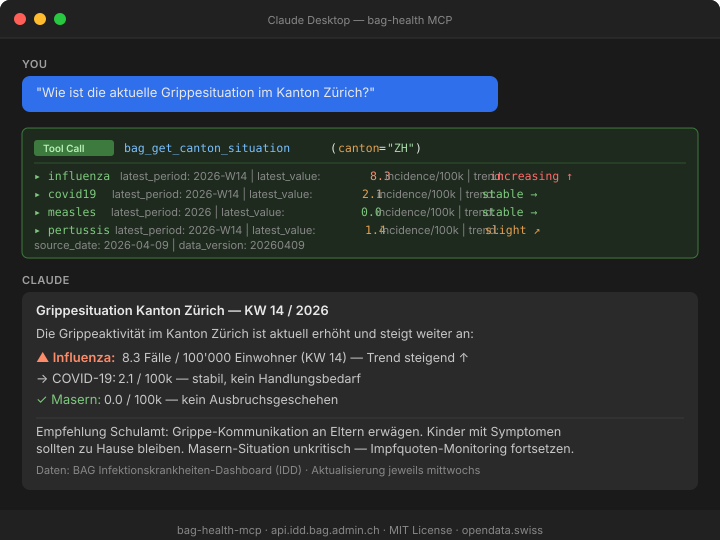

# bag-health-mcp

[](https://pypi.org/project/bag-health-mcp/)
[](https://www.python.org/)
[](LICENSE)
[](https://github.com/malkreide)

> Part of the [Swiss Public Data MCP Portfolio](https://github.com/malkreide) — connecting AI models to Swiss public data sources.

**[🇩🇪 Deutsche Version](README.de.md)**

MCP server for Swiss public health data. Its core is the Swiss Federal Office of Public Health (BAG) **Infectious Disease Dashboard (IDD)** — epidemiological surveillance for 51 pathogens (influenza, COVID-19, measles, wastewater surveillance, and more) — extended with a **multi-source health-indicator layer** over the Swiss Health Observatory (**Obsan**), the **Versorgungsatlas** (health-care supply atlas, with cantonal series) and **Sucht Schweiz** (HBSC youth survey). All read-only, public Open Government Data.

---

## What You Can Do

```
"Wie ist die aktuelle Grippesituation im Kanton Zürich verglichen mit den letzten Wochen?"
→ bag_health_mcp__get_canton_situation(canton="ZH")

"Gibt es aktuell einen Masernausbruch in der Schweiz?"
→ bag_health_mcp__get_disease_data(series_id="measles/cases/incValue/year", canton="all")

"Wie entwickelt sich das SARS-CoV-2-Signal im Abwasser?"
→ bag_health_mcp__list_series(topic="wastewater_viral_load")
→ bag_health_mcp__get_disease_data(series_id="wastewater_viral_load/NA/value/date", ...)

"Welche Krankheitsdaten stellt das BAG aktuell bereit?"
→ bag_health_mcp__list_diseases()

"Wie hat sich der Alkoholkonsum bei 15-Jährigen seit 2010 entwickelt?"   # 🎯 anchor query
→ bag_health_mcp__search_health_indicators(source="suchtschweiz", topic="alkohol")
→ bag_health_mcp__get_indicator_series(source="suchtschweiz",
      indicator_id="monam/alkoholkonsum-alter-11-15", region="ZH", year_from=2010)
→ More use cases by audience →
```

> **🎯 Anchor demo query** — *«Wie hat sich der Alkoholkonsum bei 15-Jährigen im
> Kanton Zürich seit 2010 entwickelt, und wie steht der Kanton im Schweizer
> Vergleich da?»* The HBSC youth series (via Obsan) answers the **Switzerland-wide**
> trend since 2010 with 95% confidence intervals. This particular indicator is
> **national only**, so the response includes a `region_note` saying so
> (HBSC is not cantonally representative). Most other Obsan indicators *are*
> published by canton — see the note on cuts below. These are **aggregated
> population statistics — not individual advice.**
> See [`docs/tool-design-health-indicators.md`](docs/tool-design-health-indicators.md).

---

## Tools

Infectious-disease surveillance (BAG IDD):

| Tool | Description |
|------|-------------|
| `bag_health_mcp__list_diseases` | List all 51 disease topics, grouped by category |
| `bag_health_mcp__list_series` | List data series for a specific disease |
| `bag_health_mcp__get_series_details` | Get available filter dimensions (canton, age, sex) |
| `bag_health_mcp__get_disease_data` | Fetch time-series surveillance data |
| `bag_health_mcp__get_canton_situation` | Situational overview for a canton (Schulamt use case) |
| `bag_health_mcp__list_export_files` | List available complete export datasets |
| `bag_health_mcp__download_export` | Download raw CSV/JSON export |
| `bag_health_mcp__get_data_version` | Current data version (updated every Wednesday) |

Health indicators — Obsan, Versorgungsatlas & Sucht Schweiz (multi-source):

| Tool | Description |
|------|-------------|
| `bag_health_mcp__search_health_indicators` | Search indicators by `source` (`obsan` / `versorgungsatlas` / `suchtschweiz`), topic, region, year range |
| `bag_health_mcp__get_indicator_series` | Fetch one indicator's time series, naming which **cut** it is (`variant`: national / by canton / by age class / by social position / distribution) and which others exist. Pass `region='ZH'` for the cantonal cut; 95% CIs throughout |

> ⚠️ **Aggregated population statistics only.** The indicator tools serve
> population-level aggregates (prevalences/metrics by age/sex/region) — **not
> individual advice, diagnosis or case assessment, and no personal data.** This is
> stated in both tool descriptions and every response (`aggregate_statistics_notice`),
> and matters especially for `suchtschweiz` (HBSC), which touches prevention topics
> in a school context. Sources: Obsan `ind.obsan.admin.ch` (clean JSON API);
> Sucht Schweiz HBSC via the Obsan mirror (national); **Versorgungsatlas** returns a
> **cantonal** year/value series (26 cantons + a `CH` national total, with 95% CIs and
> a canton-vs-CH ratio) from the Tarifpool. See the per-source [probe notes](docs/).

> **Obsan publishes an indicator in several cuts, not one series.** Measured over
> 60 catalogue entries on 2026-08-08: 50 have a cantonal cut (`kg`), 49 one by age
> class (`ag`), 24 one by social position (`sd`) — and only 3 the plain national
> one (`g`). They are different measurements with different units, so
> `get_indicator_series` names the cut it returned in `variant` and lists the rest
> in `variants_available`, rather than presenting one as a stand-in for another.
> Eight of the 60 publish no series at all; that case fails with its reason
> instead of returning an empty result. The census is recorded and dated in
> [`tests/fixtures/obsan_variant_census.json`](tests/fixtures/obsan_variant_census.json).

### Tool annotations

All tools carry MCP [tool annotations](https://modelcontextprotocol.io/) so a
host can reason about them without calling. Every tool is identical here — it
only ever reads from the public, allow-listed data sources (BAG IDD, Obsan,
Versorgungsatlas):

| Annotation | Value | Meaning |
|------------|-------|---------|
| `readOnlyHint` | `true` | No tool mutates any state. |
| `destructiveHint` | `false` | No destructive side effects. |
| `idempotentHint` | `true` | Repeating a call has no additional effect. |
| `openWorldHint` | `true` | Tools reach an external system (the upstream data APIs). |

A host may therefore treat all calls as safe, cacheable reads. The values are
declared once as `READ_ONLY` in `server.py` and applied to all 10 tools.

## MCP Primitives

This server uses all three MCP primitives, each for what it is best at:

**Tools** (10) — live, parameterised actions that call the IDD API (above).

**Resources** — static, read-only reference data a host can fetch and cache, no
arguments or upstream call needed:

| Resource URI | Description |
|--------------|-------------|
| `bag://reference/cantons` | Canton codes accepted by the tools (incl. FL, `all`) |
| `bag://reference/disease-categories` | Disease-topic taxonomy by category |
| `bag://reference/data-licence` | Source, attribution and licence terms |

**Prompts** — reusable, parameterised workflows a host can surface (e.g. as
slash-commands):

| Prompt | Arguments | Purpose |
|--------|-----------|---------|
| `canton_situation_brief` | `canton` | Draft a Schulamt public-health situation brief |
| `outbreak_check` | `disease`, `canton` | Check whether a disease is currently elevated |

Live surveillance data stays behind Tools (it is parameterised and changes
weekly); fixed reference data is exposed as Resources; recommended multi-tool
workflows are packaged as Prompts.

---

## Relevance for Schools & City Administration

**Schulamt / Kreisschulbehörden:**
- Monitor influenza and ARI incidence in your canton
- Single measles case → alert for schools with low vaccination coverage
- Pertussis tracking → protect unvaccinated infants (siblings of school children)

**Stadtverwaltung / KI-Fachgruppe:**
- Public Health Reporting with structured weekly data
- Wastewater surveillance as 1-week lead indicator before clinical cases

**Synergy with portfolio:**
- `bag-epl-mcp` → "What treatments are listed?" (EPL medication database)
- `bag-health-mcp` → "What is currently spreading?" (surveillance data)

---

## Data Source

- **IDD API**: `https://api.idd.bag.admin.ch` — No authentication required
- **Update cycle**: Every Wednesday
- **Coverage**: Switzerland + Liechtenstein (FL), 26 cantons
- **Topics**: 51 pathogens, 1386 data series

### Datenquellen & Lizenzen / Data sources & licences

| Source | Provider | Licence | Attribution required |
|--------|----------|---------|----------------------|
| Infectious Disease Dashboard (IDD) | Federal Office of Public Health (FOPH / BAG) | [opendata.swiss](https://opendata.swiss) Open Government Data — *free use, source attribution required* (Swiss OGD terms, CC BY-equivalent) | Yes |
| Health indicators | Obsan — Swiss Health Observatory (`ind.obsan.admin.ch`) | No explicit machine-readable licence; treat as Swiss OGD practice — *free use, cite the per-indicator source* | Yes |
| Health-care supply atlas | Versorgungsatlas (BAG/Obsan, `versorgungsatlas.ch`) | Same (Swiss OGD practice, cite source) | Yes |
| HBSC youth survey | Sucht Schweiz — HBSC, obtained via the Obsan mirror | Same (Swiss OGD practice, cite «Sucht Schweiz — HBSC») | Yes |

**Required citation:** *Federal Office of Public Health FOPH — Infectious Disease
Dashboard (IDD), open data via opendata.swiss.* For the indicator tools, each
response's `provenance.source` names the concrete upstream (e.g. «Sucht Schweiz —
HBSC» via Obsan). Every tool response carries attribution in a `provenance` block
(`attribution` + `license` fields) so downstream consumers can surface it
automatically.

```
Architecture:
                    ┌─────────────────┐    api.idd.bag.admin.ch (IDD API, no auth)
  MCP Host          │  bag-health-mcp │──▶ ind.obsan.admin.ch   (Obsan JSON API)
  (Claude, etc.) ──▶│  MCP SDK        │──▶ versorgungsatlas.ch  (indicator catalogue)
                    │  10 Tools       │    all HTTPS, egress allow-listed, no auth
                    └─────────────────┘
```

---

## Installation

### Claude Desktop (stdio)

```json
{
  "mcpServers": {
    "bag-health": {
      "command": "uvx",
      "args": ["bag-health-mcp"]
    }
  }
}
```

### Cloud / HTTP

```bash
pip install bag-health-mcp
python -m bag_health_mcp.server --http --port 8000
```

Transport, host and port are set via environment variables — `MCP_TRANSPORT`
(`http`/`stdio`), `MCP_HOST`, `MCP_PORT` — which is the recommended way for
deployments (the `--http` flag still works for local use). The server binds to
`127.0.0.1` by default so a local HTTP server is **not** exposed to the network.
Container/cloud deployments bind all interfaces by setting `MCP_HOST=0.0.0.0`
explicitly — the provided `Dockerfile` does this.

> ⚠️ **Security:** HTTP transport exposes the server on the network. Only bind
> beyond `127.0.0.1` in a **network-isolated** environment — never directly on a
> public/shared network. Binding to a non-localhost host logs a warning at
> startup. The default stdio transport has no network surface. See
> [`docs/security-posture.md`](docs/security-posture.md).

**HTTP auth (optional):** set `MCP_AUTH_TOKEN` to require
`Authorization: Bearer <token>` on every HTTP request (401 otherwise). Unset =
no auth (fine for stdio/local). This gates *who may invoke* the server; for real
user identity, front it with a gateway.

**CORS (browser clients):** set `MCP_CORS_ORIGINS` to a comma-separated origin
allow-list to enable cross-origin browser access; the `Mcp-Session-Id` header is
exposed so stateful sessions work. Empty = no cross-origin (never a wildcard).

**Host allow-list (DNS rebinding):** set `MCP_ALLOWED_HOSTS` to a comma-separated
list of the names this server is reachable under, including the port, e.g.
`bag.example.ch:8000`. Requests arriving under any other `Host` are rejected
with **421**; loopback stays allowed so container health checks keep working.

Unset on a non-localhost bind, the check is left off and a warning is logged —
that is the gateway-fronted deployment, where the gateway validates `Host`. It
is not guessed: on `0.0.0.0` the reachable name is unknowable here, and a wrong
guess would reject the very deployment it is meant to protect.

This is independent of `MCP_AUTH_TOKEN`. The token says *who* is asking; this
says *under which name* the server is addressed. A rebinding attack runs in a
browser that already holds the token.

For running at scale (session affinity, resource limits, MCP gateway), see the
[deployment & scaling guide](docs/deployment-scaling.md) and the reference
manifests in [`deploy/`](deploy/).

**Logging:** the server emits structured JSON logs (one object per line, with an
RFC 5424 severity) to **stderr** — stdout is reserved for the stdio JSON-RPC
transport. Set the level with `MCP_LOG_LEVEL` (default `INFO`).

**Tracing (optional):** install the telemetry extra and point the server at an
OTLP collector to get OpenTelemetry spans per tool-call plus instrumented
outbound HTTP:

```bash
pip install "bag-health-mcp[telemetry]"
export OTEL_EXPORTER_OTLP_ENDPOINT="http://otel-collector:4318"
# optional: OTEL_SERVICE_NAME=bag-health-mcp
```

Tracing is a **no-op** unless both the extra is installed and an `OTEL_*`
endpoint is set. Spans carry only the tool name and (on error) the exception
class — never tool arguments, cantons or surveillance data.

---

## Available Disease Topics

| Category | Topics |
|----------|--------|
| Respiratory | influenza, covid19, acute_respiratory_infection, respiratory_pathogens |
| Enteric | campylobacteriosis, salmonellosis, ehec, listeriosis, hepatitis_a/e |
| STI & Bloodborne | hiv, aids, syphilis, gonorrhea, hepatitis_b/c, chlamydiosis |
| Vaccine-preventable | measles, pertussis, rubella, tetanus, diphtheria, ipd, meningo |
| Vector-borne | lyme_borreliosis, tick-borne_encephalitis, dengue, malaria, zika |
| Wastewater | wastewater_viral_load, wastewater_sequencing |

---

## Demo



*Claude asking about the influenza situation in canton Zurich — single tool call, structured result, actionable German-language summary.*

---

## Safety & Limits

| Aspect | Details |
|--------|---------|
| Access | Read-only — no write operations possible |
| Egress | Code-layer allow-list: the server only contacts three public data hosts (`api.idd.bag.admin.ch`, `ind.obsan.admin.ch`, `www.versorgungsatlas.ch`), HTTPS-only, enforced on every request incl. redirect hops (SSRF/SEC-004 + SEC-021). Network-layer companion policy in [`deploy/networkpolicy.yaml`](deploy/networkpolicy.yaml) |
| Personal data | None — all sources are aggregated/anonymised (BAG IDD at canton level by law; indicators are population aggregates by age/sex/region) |
| Rate limits | No published IDD API rate limit; server caps responses at 104 data points per call by default (`limit_weeks` param) |
| Timeout | 30 s per API call |
| Authentication | No API keys required — all data publicly accessible |
| Data licence | opendata.swiss OGD — **free use, source attribution required** (CC BY-equivalent). FOPH IDD must be cited; see [Data sources & licences](#datenquellen--lizenzen--data-sources--licences) |
| Terms of Service | Subject to [BAG IDD API ToS](https://api.idd.bag.admin.ch) |

---

## Known Limitations

- **Beta API**: IDD API is labelled `v0.1 beta` — schema may change without notice
- **Weekly cadence**: Data is not real-time; updated Wednesdays only
- **Canton granularity**: Some rare diseases have insufficient cases for canton-level data (suppressed for privacy)
- **Age groups**: Available dimensions vary by disease series; use `bag_health_mcp__get_series_details` to check

---

## Compliance

- **ISDS (Stadt Zürich):** a draft information-security protection-needs
  classification (Schutzbedarfsanalyse per Grundwert + measures mapping) is in
  [`docs/isds-klassifikation.md`](docs/isds-klassifikation.md). It is a
  technically-grounded **draft pending ISBO/OIZ sign-off** — not a binding
  classification.
- **Data classification (Schulamt):** the data is classified **ÖFFENTLICH / BUI**
  (public OGD, no personal data, aggregated at canton level with small cells
  suppressed at source). Draft scheme + aggregation-risk note in
  [`docs/datenklassifikation-schulamt.md`](docs/datenklassifikation-schulamt.md);
  the aggregating `bag_health_mcp__get_canton_situation` tool surfaces this in its response.
- **Security posture:** lethal-trifecta assessment (the server is strictly
  read-only → not affected), secret-management decision (no secrets — public
  data), and network-exposure notes are in
  [`docs/security-posture.md`](docs/security-posture.md).
- **Phase architecture:** this is a **Phase 1 (read-only)** server; write/send
  capabilities are deferred behind documented prerequisites. See
  [`docs/roadmap.md`](docs/roadmap.md).
- **Reporting vulnerabilities:** see the [security policy](SECURITY.md) for how to
  report security issues privately.

---

## Contributing

See [CONTRIBUTING.md](CONTRIBUTING.md) ([Deutsch](CONTRIBUTING.de.md)).

## Security

See [SECURITY.md](SECURITY.md) ([Deutsch](SECURITY.de.md)) for the security
posture and how to report a vulnerability confidentially.

## License

**Code:** MIT (see [LICENSE](LICENSE)).

**Data:** BAG IDD is Open Government Data on [opendata.swiss](https://opendata.swiss)
under *free use with mandatory source attribution* (Swiss OGD terms, CC BY-equivalent)
— **not** public domain. Cite the Federal Office of Public Health FOPH (IDD) when
reusing the data; see [Data sources & licences](#datenquellen--lizenzen--data-sources--licences).

## Author

**Hayal Oezkan** · [github.com/malkreide](https://github.com/malkreide)

## Related Portfolio Servers

- [`swiss-statistics-mcp`](https://github.com/malkreide/swiss-statistics-mcp) — BFS demographic data
- [`bag-epl-mcp`](https://github.com/malkreide/bag-epl-mcp) — BAG medication reimbursement list
- [`zurich-opendata-mcp`](https://github.com/malkreide/zurich-opendata-mcp) — City of Zurich open data

<!-- mcp-name: io.github.malkreide/bag-health-mcp -->

<!-- BEGIN GENERATED: install -->
## Installation

Run via [`uv`](https://docs.astral.sh/uv/)'s `uvx` — no clone or manual install needed. Add to your MCP client config (`mcpServers` for Claude Desktop, Cursor and Windsurf; use a top-level `servers` key for VS Code in `.vscode/mcp.json`):

```json
{
  "mcpServers": {
    "bag-health-mcp": {
      "command": "uvx",
      "args": [
        "bag-health-mcp"
      ]
    }
  }
}
```
<!-- END GENERATED: install -->
